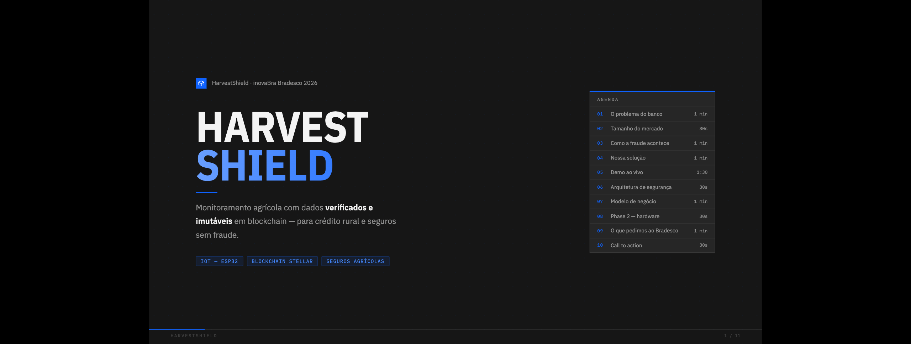
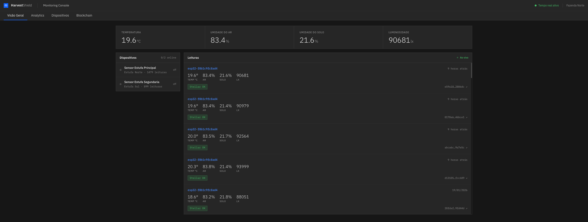

<p align="center">
  
</p>

<h3 align="center">Monitoramento agricola com dados verificados e imutaveis em blockchain</h3>

<p align="center">
  <code>IoT — ESP32</code>&nbsp;&nbsp;
  <code>Blockchain Stellar</code>&nbsp;&nbsp;
  <code>Seguros Agricolas</code>
</p>

---

## Como funciona

```
ESP32 (sensores)          Oracle (Supabase)           Stellar
┌──────────────┐         ┌──────────────────┐        ┌──────────┐
│ Temperatura  │  HTTPS  │ Valida PoW       │        │ manageData│
│ Umidade ar   │────────>│ Verifica ECDSA   │───────>│ tx com    │
│ Umidade solo │  +PoW   │ Salva PostgreSQL │ async  │ hash PoW  │
│ Luminosidade │ +ECDSA  │                  │        │           │
└──────────────┘         └──────────────────┘        └──────────┘
                                  │
                                  v
                          ┌──────────────────┐
                          │ Dashboard        │
                          │ tempo real +     │
                          │ status blockchain│
                          └──────────────────┘
```

Cada leitura de sensor e **assinada criptograficamente** no dispositivo, validada por **Proof of Work**, salva em **PostgreSQL** e registrada na **blockchain Stellar**. Nenhum dado pode ser alterado retroativamente.

<p align="center">
  
</p>

---

## Estrutura do projeto

```
harvestshield/
├── iot/              # Firmware ESP32 (C++ / PlatformIO)
├── backend/
│   ├── supabase/     # Edge Functions + migrations PostgreSQL
│   └── scripts/      # Scripts Python de teste e simulacao
├── dashboard/        # Painel de monitoramento (React + Vite)
├── pitch/            # Apresentacao para investidores (React + Vite)
├── docs/             # Arquitetura, PRD, manual
└── keys/             # Chaves ECDSA dos dispositivos
```

---

## Deploy completo

### Pre-requisitos

- [Node.js](https://nodejs.org) >= 18
- [Supabase CLI](https://supabase.com/docs/guides/cli)
- [PlatformIO](https://platformio.org) (para o firmware)
- [Vercel CLI](https://vercel.com/docs/cli) (opcional, pode usar a UI)
- Conta [Supabase](https://supabase.com)
- Conta [Stellar](https://stellar.org) (testnet para desenvolvimento)
- Python 3.x (para scripts de teste)

---

### 1. Supabase (Backend)

O backend roda inteiramente no Supabase: banco PostgreSQL + Edge Functions.

#### 1.1 Criar projeto no Supabase

1. Acesse [supabase.com/dashboard](https://supabase.com/dashboard) e crie um novo projeto
2. Anote os valores de **Settings > API**:
   - `Project URL` — ex: `https://abcdef.supabase.co`
   - `anon public key` — ex: `eyJhbG...`
   - `service_role key` — (usado internamente, nao expor)

#### 1.2 Rodar migrations

```bash
cd backend/supabase

# Linkar com seu projeto
supabase link --project-ref SEU_PROJECT_REF

# Aplicar migrations (cria tabelas readings e devices)
supabase db push
```

Isso cria as tabelas:
- **`readings`** — leituras de sensores + status blockchain
- **`devices`** — dispositivos autorizados com chave publica ECDSA

#### 1.3 Registrar dispositivo

Cada ESP32 precisa estar na tabela `devices` com sua chave publica.

> **IMPORTANTE:** O `device_id` e gerado automaticamente pelo ESP32 a partir do MAC address, no formato `esp32-{MAC}` (ex: `esp32-f0b1c9fc8ad4`). Para descobrir o ID do seu dispositivo, conecte o ESP32 via USB e verifique o Serial Monitor (`pio device monitor`) — o ID aparece na inicializacao.

No SQL Editor do Supabase:

```sql
INSERT INTO devices (device_id, public_key, name, location)
VALUES (
    'esp32-xxxxxxxxxxxx',  -- substitua pelo device_id do Serial Monitor
    '-----BEGIN PUBLIC KEY-----
MFkwEwYHKoZIzj0CAQYIKoZIzj0DAQcDQgAE...sua-chave...
-----END PUBLIC KEY-----',
    'Sensor Estufa Principal',
    'Estufa Norte'
);
```

> Para gerar um par de chaves: `openssl ecparam -genkey -name prime256v1 -noout -out device.key && openssl ec -in device.key -pubout -out device.pub`

#### 1.4 Configurar Stellar

Crie uma conta Stellar testnet em [laboratory.stellar.org](https://laboratory.stellar.org/#account-creator?network=test).

No Supabase Dashboard > **Edge Functions > Secrets**, adicione:

| Secret | Valor |
|--------|-------|
| `STELLAR_SECRET_KEY` | `SBXX...` (chave secreta Stellar) |
| `STELLAR_NETWORK` | `testnet` |

#### 1.5 Deploy das Edge Functions

```bash
cd backend/supabase

supabase functions deploy oracle
supabase functions deploy get-readings
```

> **Teste rapido:** `curl https://SEU_PROJETO.supabase.co/functions/v1/get-readings`

---

### 2. Dashboard (Vercel)

O dashboard mostra leituras em tempo real e status das transacoes blockchain.

#### 2.1 Configurar variaveis de ambiente

```bash
cd dashboard
cp .env.example .env
```

Edite `.env`:
```env
VITE_SUPABASE_URL=https://SEU_PROJETO.supabase.co
VITE_SUPABASE_PUBLISHABLE_KEY=sua-anon-key
VITE_STELLAR_NETWORK=testnet
```

#### 2.2 Testar localmente

```bash
npm install
npm run dev
# Abre em http://localhost:3000
```

#### 2.3 Deploy na Vercel

**Opcao A — Via CLI:**
```bash
npm i -g vercel
vercel

# Quando perguntar sobre variaveis, adicione as mesmas do .env
```

**Opcao B — Via UI:**
1. Acesse [vercel.com/new](https://vercel.com/new)
2. Importe o repositorio
3. **Root Directory:** `dashboard`
4. **Build Command:** `tsc && vite build`
5. **Output Directory:** `dist`
6. Adicione as variaveis de ambiente:
   - `VITE_SUPABASE_URL`
   - `VITE_SUPABASE_PUBLISHABLE_KEY`
   - `VITE_STELLAR_NETWORK`

> Anote a URL do deploy (ex: `https://harvestshield-dashboard.vercel.app`) — voce vai precisar no pitch.

---

### 3. Pitch (Vercel)

A apresentacao interativa para investidores. Inclui um iframe com o dashboard ao vivo.

#### 3.1 Atualizar URL do dashboard

Edite `pitch/src/Presentation.jsx` linha 7:

```javascript
const DASHBOARD_URL = 'https://harvestshield-dashboard.vercel.app'  // URL do seu deploy
```

#### 3.2 Testar localmente

```bash
cd pitch
npm install
npm run dev
# Abre em http://localhost:3001
```

#### 3.3 Deploy na Vercel

**Opcao A — Via CLI:**
```bash
cd pitch
vercel
```

**Opcao B — Via UI:**
1. Acesse [vercel.com/new](https://vercel.com/new)
2. Importe o **mesmo repositorio**
3. **Root Directory:** `pitch`
4. **Build Command:** `vite build`
5. **Output Directory:** `dist`

---

### 4. IoT — ESP32

O firmware roda no ESP32 e envia leituras assinadas para o Supabase.

#### 4.1 Instalar PlatformIO

```bash
# Via pip
pip install platformio

# Ou via extensao do VS Code: "PlatformIO IDE"
```

#### 4.2 Configurar credenciais

```bash
cd iot
cp include/config.example.h include/config.h
```

Edite `include/config.h`:
```cpp
// WiFi da rede onde o ESP32 vai operar
#define WIFI_SSID     "NOME_DA_REDE"
#define WIFI_PASSWORD "SENHA_DA_REDE"

// Supabase — mesmos valores do dashboard
#define SUPABASE_URL      "https://SEU_PROJETO.supabase.co/functions/v1"
#define SUPABASE_ANON_KEY "sua-anon-key"
```

#### 4.3 Gravar chave privada no ESP32

A chave ECDSA e armazenada no NVS (Non-Volatile Storage) do ESP32. Na primeira execucao, o firmware solicita a chave via Serial Monitor.

Alternativamente, use o script de simulacao para testar sem hardware:
```bash
cd backend/scripts
cp .env.example .env
# Preencha .env com suas credenciais

pip install -r requirements.txt
python simulate_esp32.py
```

#### 4.4 Upload do firmware

```bash
cd iot
pio run -t upload      # Compila e grava no ESP32
pio device monitor     # Acompanha logs serial
```

---

## Configuracao de URLs

Apos o deploy do Supabase, atualize a URL do projeto nos seguintes arquivos:

| Arquivo | Variavel | Valor |
|---------|----------|-------|
| `iot/include/config.h` | `SUPABASE_URL` | `https://<PROJECT_REF>.supabase.co/functions/v1` |
| `iot/include/config.example.h` | `SUPABASE_URL` | `https://<PROJECT_REF>.supabase.co/functions/v1` |
| `dashboard/.env` | `VITE_SUPABASE_URL` | `https://<PROJECT_REF>.supabase.co` |
| `dashboard/.env.example` | `VITE_SUPABASE_URL` | `https://<PROJECT_REF>.supabase.co` |
| `backend/scripts/.env` | `SUPABASE_URL` | `https://<PROJECT_REF>.supabase.co/functions/v1` |
| `backend/scripts/.env.example` | `SUPABASE_URL` | `https://<PROJECT_REF>.supabase.co/functions/v1` |

> Substitua `<PROJECT_REF>` pelo Reference ID do seu projeto Supabase (encontrado em **Settings > General**).
> O `SUPABASE_ANON_KEY` / `VITE_SUPABASE_PUBLISHABLE_KEY` tambem precisa ser atualizado com a **anon key** do projeto (encontrada em **Settings > API**).

---

## Mapa de conexoes

```
┌─────────────────────────────────────────────────────────────┐
│                                                             │
│   ESP32 (iot/)                                              │
│   ─────────────                                             │
│   Envia POST para:                                          │
│   {SUPABASE_URL}/oracle                                     │
│   Headers: X-Device-ID, X-PoW-*, X-Signature, X-Timestamp  │
│                                                             │
│           │                                                 │
│           v                                                 │
│                                                             │
│   Supabase (backend/supabase/)                              │
│   ────────────────────────────                              │
│   oracle/     ← recebe leituras, valida, salva, Stellar TX │
│   get-readings/ ← API REST para o dashboard                │
│                                                             │
│           │                                                 │
│           v                                                 │
│                                                             │
│   Dashboard (dashboard/)                                    │
│   ──────────────────────                                    │
│   Conecta em: {VITE_SUPABASE_URL}                           │
│   Mostra sensores + blockchain em tempo real                │
│                                                             │
│           │                                                 │
│           v                                                 │
│                                                             │
│   Pitch (pitch/)                                            │
│   ──────────────                                            │
│   Embeds: {DASHBOARD_URL} em iframe                         │
│   Links: abre dashboard em nova aba                         │
│                                                             │
└─────────────────────────────────────────────────────────────┘
```

---

## Seguranca

| Camada | Protecao |
|--------|----------|
| **Dispositivo** | ECDSA P-256 — cada ESP32 tem chave privada unica no NVS |
| **Transporte** | Proof of Work SHA-256 (dificuldade 3) + HTTPS |
| **Anti-replay** | Janela de timestamp de 5 minutos |
| **Banco** | PostgreSQL RLS (Row Level Security) |
| **Blockchain** | Transacoes Stellar imutaveis com hash da leitura |

---

## Desenvolvimento local

```bash
# Terminal 1 — Backend
cd backend/supabase && supabase start

# Terminal 2 — Dashboard
cd dashboard && npm install && npm run dev

# Terminal 3 — Pitch
cd pitch && npm install && npm run dev

# Terminal 4 — Simulador ESP32
cd backend/scripts && python simulate_esp32.py
```

---

## Licenca

Proprietario — Alcoran Blockchain Solutions
